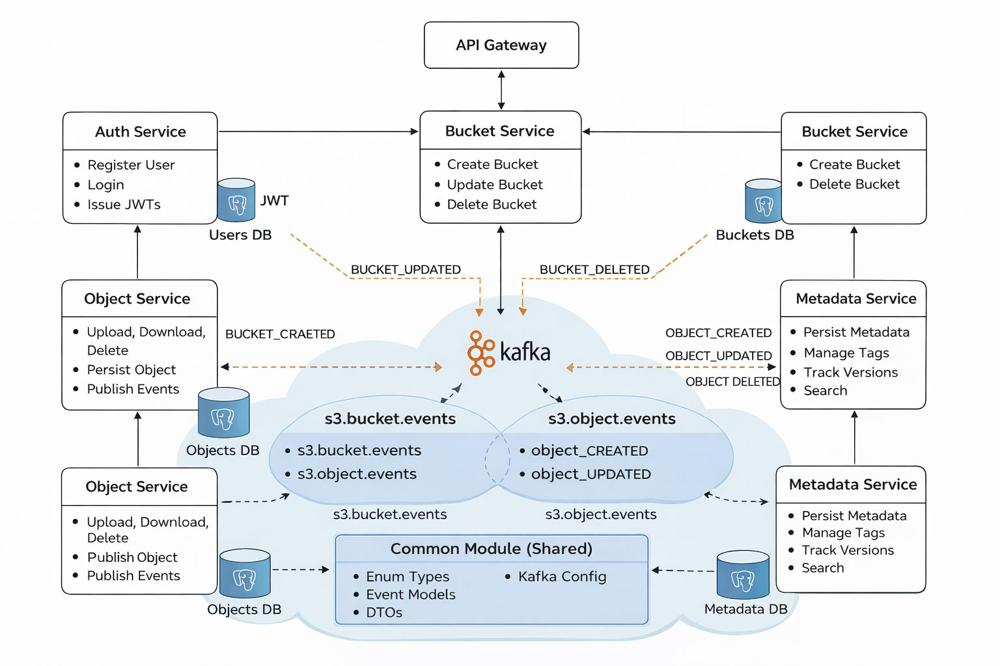

# System Architecture

This document describes the overall architecture of the **S3-like Object Storage System**, including infrastructure choices, cross-cutting concerns, shared components, and service-level responsibilities.

The system is designed as a **loosely coupled, event-driven microservices architecture**, inspired by real-world cloud storage platforms such as Amazon S3.

---

## 1. Project Goal

The goal of this project is to build a simplified version of Amazon S3 that allows authenticated users to:

- Create and manage buckets
- Upload, download, and delete objects
- Manage object metadata (tags, description, access level)
- Support object versioning
- Search objects using metadata

The project demonstrates backend engineering concepts such as **microservices design**, **event-driven communication**, **secure authentication**, and **scalable data modeling**.

---

## 2. Tech Stack

### Backend & Framework
- **Language:** Java 17
- **Framework:** Spring Boot 3.x
- **ORM:** Spring Data JPA + Hibernate
- **Build Tool:** Maven

### Security
- **Authentication:** JWT (Spring Security)

### Data & Storage
- **Database:** PostgreSQL
- **Migrations:** Flyway
- **Object Storage:** Local filesystem

### Messaging & Events
- **Message Broker:** Apache Kafka
- **Serialization:** JSON (Jackson)

### Documentation & Tooling
- **API Documentation:** Swagger (springdoc-openapi)
- **Containerization:** Docker (Kafka + PostgreSQL)

---

## 3. Infrastructure Overview

The system runs as multiple Spring Boot services communicating over HTTP and Kafka.

- PostgreSQL is used as the primary relational datastore
- Kafka is used for asynchronous event propagation
- Local filesystem is used to store uploaded objects
- Docker is used to run infrastructure dependencies locally

Each microservice owns:
- its database schema
- its business logic
- its event contracts

No service directly accesses another service’s database.

---

## 4. Architectural Overview

The system is composed of multiple independently deployable services:

- **auth-service** – user authentication and JWT issuance
- **bucket-service** – bucket lifecycle management
- **object-service** – file upload/download and storage
- **metadata-service** – metadata, tags, versioning, and search
- **common module** – shared DTOs, events, security, and utilities

Each service communicates with others **only through REST APIs or Kafka events**, ensuring loose coupling and clear ownership boundaries.

---

## 5. System Architecture Diagram

The diagram below illustrates the high-level system architecture, including client interaction, service boundaries, Kafka-based event communication, and shared infrastructure.

---

## 6. Cross-Cutting Concerns

### 6.1 Logging

- Centralized logging using **SLF4J**
- Consistent log format across services
- Correlation identifiers (request-id / trace-id) propagated via filters
- Log levels:
    - INFO for business flow
    - WARN for recoverable issues
    - ERROR for failures

This simplifies debugging in a distributed environment.

---

### 6.2 Exception Handling

- Global exception handling using `@ControllerAdvice`
- Consistent error response structure across services
- Custom domain exceptions:
    - `ResourceNotFoundException`
    - `InvalidRequestException`
    - `UnauthorizedException`

Internal errors are never exposed directly to clients.

---

### 6.3 Security & Authentication

- JWT-based authentication across all services
- Tokens validated at service boundaries
- User identity injected using `@AuthenticationPrincipal`
- **ownerId is never accepted from request payloads**
    - Always derived from JWT
    - Prevents spoofing and privilege escalation

---

## 7. Common Module (Shared Infrastructure)

The `common` module provides shared building blocks used by all services.

### Responsibilities
- Shared request/response DTOs
- Event models and payloads
- Enum definitions (AccessLevel, EventType, SourceService)
- Kafka producer configuration
- Security utilities

This avoids duplication and enforces consistent contracts.

---

## 8. Event Framework

All services publish and consume events using a **generic event envelope**:

- `S3Event<T extends S3EventPayload>`
- Separation between:
    - Event metadata (eventId, type, source, owner)
    - Business payload

Key design decisions:
- `eventType` represents business intent
- `payloadType` enables safe polymorphic deserialization
- Jackson polymorphism is applied only at the payload level
- Events are immutable and backward-compatible

---

## 9. Microservices Responsibilities

### 9.1 Auth Service
- User registration
- Login
- JWT issuance
- Stateless and isolated

---

### 9.2 Bucket Service
- Bucket creation, update, deletion
- Bucket-level configuration (versioning)
- Publishes:
    - `BUCKET_UPDATED`
    - `BUCKET_DELETED`

Bucket service does not manage objects directly.

---

### 9.3 Object Service
- File upload, download, and deletion
- Local filesystem storage
- Object persistence
- Reacts to bucket events
- Publishes:
    - `OBJECT_CREATED`
    - `OBJECT_UPDATED`
    - `OBJECT_DELETED`

Object service does not manage metadata or versions.

---

### 9.4 Metadata Service
- Object metadata persistence
- Tag management
- Search functionality
- Object versioning
- Idempotent event processing

Owns:
- `object_metadata`
- `object_tags`
- `object_versions`
- `processed_events`

Optimized for read, search, and audit use cases.

---

## 10. Event-Driven Communication

- No synchronous cross-service state mutation
- All state propagation via Kafka
- Events are immutable and idempotent

This enables:
- Loose coupling
- Independent scaling
- Fault tolerance
- Safe retries and recovery

---

## 11. API Design Philosophy

- RESTful APIs
- Resource-oriented URLs
- HTTP verbs aligned with intent
- DTO-based contracts
- Validation at controller boundary

Examples:
- `/buckets/{bucketName}`
- `/objects/{bucketName}/{fileName}`
- `/metadata/search`

---

## 12. Summary

This architecture demonstrates:
- Production-grade microservice design
- Event-driven consistency
- Clear ownership boundaries
- Secure authentication
- Scalable and extensible infrastructure

The system mirrors real-world cloud storage platforms while remaining simple, maintainable, and review-friendly.
