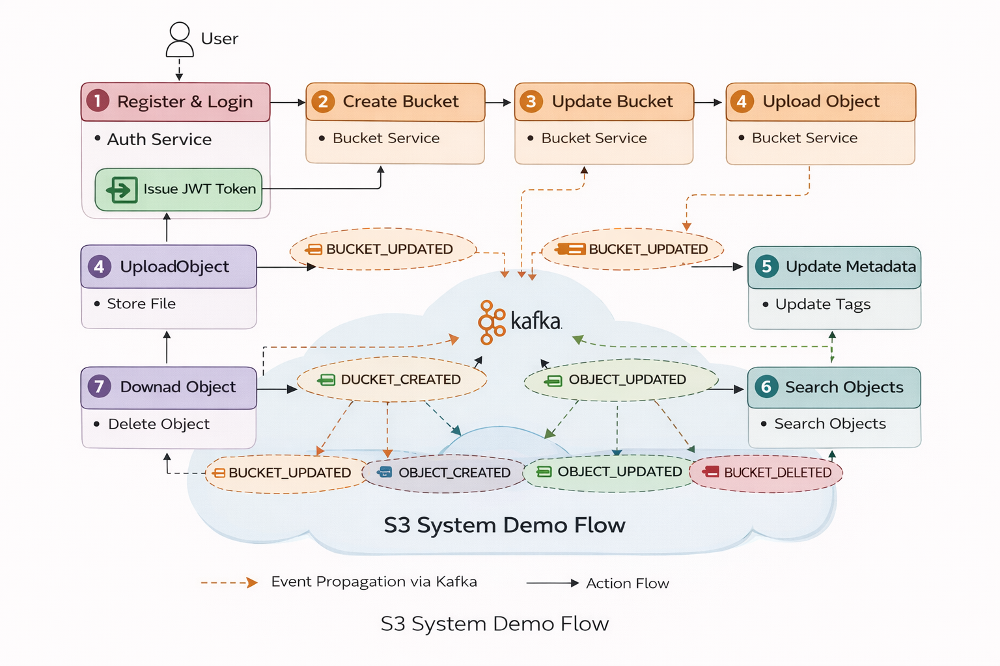

# Demo Flow & Usage Walkthrough

This document describes a step-by-step walkthrough of the S3-like Object Storage System, demonstrating how a user interacts with the platform and how services collaborate internally.

The flow is designed to align with the project requirements and highlight key architectural decisions such as authentication, event-driven communication, and metadata management.

---

## 1. User Registration & Authentication

1. User registers using the auth-service.
2. User logs in with valid credentials.
3. auth-service issues a JWT token.
4. JWT is sent with every subsequent API request.

The JWT token contains the authenticated user identity and is used to derive `ownerId` internally.

---

## 2. Create a Bucket

1. User sends a request to create a bucket.
2. bucket-service validates bucket name uniqueness per user.
3. Bucket is created with optional versioning configuration.
4. Bucket metadata is persisted in PostgreSQL.

Bucket creation is a synchronous operation and does not trigger downstream events.

---

## 3. Update Bucket Configuration (Versioning)

1. User updates bucket versioning configuration.
2. bucket-service updates the bucket entity.
3. A `BUCKET_UPDATED` event is published to Kafka.
4. object-service consumes the event.
5. Object versioning behavior is synchronized for all objects in the bucket.

This demonstrates top-down configuration propagation using events.

---

## 4. Upload an Object

1. User uploads a file to a specific bucket.
2. object-service validates bucket existence.
3. Object metadata is persisted in the database.
4. File is stored on the local filesystem.
5. object-service publishes an `OBJECT_CREATED` event.
6. metadata-service consumes the event.
7. Metadata, tags, and initial object version are created.

Object storage and metadata management are intentionally separated.

---

## 5. Update Object Metadata

1. User updates object metadata (description, tags, access level).
2. object-service publishes an `OBJECT_UPDATED` event.
3. metadata-service updates metadata and tags.
4. If versioning is enabled, a new object version is created.

This demonstrates version-aware metadata updates.

---

## 6. Search Objects

1. User performs a search request.
2. Request is routed to metadata-service.
3. Search filters may include:
    - bucket name
    - file name
    - description
    - tags
4. metadata-service executes a flexible query.
5. Matching objects are returned.

Search is centralized in metadata-service to avoid duplication.

---

## 7. Download an Object

1. User requests to download an object.
2. object-service validates access.
3. File is read from the local filesystem.
4. File content is streamed back to the client.

---

## 8. Delete an Object

1. User deletes an object.
2. object-service deletes the object record.
3. File is removed from the filesystem.
4. object-service publishes an `OBJECT_DELETED` event.
5. metadata-service removes metadata and versions.

Cleanup is driven by events to maintain consistency.

---

## 9. Delete a Bucket

1. User deletes a bucket.
2. bucket-service deletes the bucket entity.
3. A `BUCKET_DELETED` event is published.
4. object-service consumes the event.
5. Objects under the bucket are cleaned up.
6. Corresponding metadata cleanup follows.

---

## 10. Idempotency & Reliability

- Every event contains a unique `eventId`.
- metadata-service stores processed event IDs.
- Duplicate events are ignored safely.

This ensures reliable processing even under retries or failures.

## Event Flow Diagram

The following diagram illustrates the complete event flow across all services:

---

## Summary

This demo flow demonstrates:
- Secure user authentication
- Event-driven communication
- Clear service responsibilities
- Metadata-driven search
- Version-aware object management

The system provides a simplified yet production-inspired S3-like experience.
