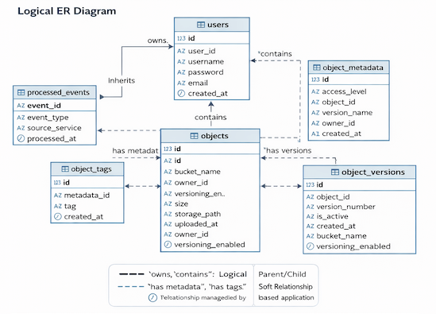
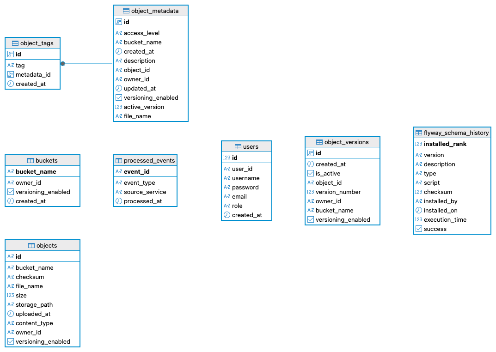

These relationships are **logical only** and documented for understanding and review.

---

## 3. Logical ER Diagram (Conceptual View)

The diagram below represents how entities relate **conceptually**, independent of physical database constraints.

- Solid lines → logical parent/child relationships
- Dashed lines → soft relationships managed by the application
- No foreign keys are enforced at the database level

---

## 4. Physical ER Diagram (PostgreSQL Schema)

This diagram reflects the **actual PostgreSQL tables** created via Flyway migrations.

Key characteristics:
- No foreign key constraints
- Uniqueness enforced where required
- Optimized for event-driven consistency

---

## 5. Table Descriptions

### 5.1 `users`

**Purpose:**  
Stores system users and authentication identity.

**Key Columns:**
- `id` – internal primary key
- `user_id` – external identifier used across services
- `username`, `email`, `role`
- `created_at`

---

### 5.2 `buckets`

**Purpose:**  
Top-level namespace for object storage.

**Key Columns:**
- `bucket_name` (primary key)
- `owner_id`
- `versioning_enabled`
- `created_at`

**Notes:**
- Bucket names are unique per user
- Bucket controls object versioning behavior

---

### 5.3 `objects`

**Purpose:**  
Represents physical files stored on disk.

**Key Columns:**
- `id`
- `bucket_name`
- `file_name`
- `owner_id`
- `storage_path`
- `checksum`
- `content_type`
- `size`
- `versioning_enabled`

**Notes:**
- `(bucket_name, file_name)` uniquely identifies an object
- Contains storage-only concerns
- Metadata is stored separately

---

### 5.4 `object_metadata`

**Purpose:**  
Stores searchable and descriptive metadata for objects.

**Key Columns:**
- `object_id` (unique)
- `bucket_name`
- `owner_id`
- `file_name`
- `access_level`
- `description`
- `versioning_enabled`
- `active_version`
- `created_at`, `updated_at`

**Notes:**
- One metadata record per object
- Optimized for search and filtering

---

### 5.5 `object_tags`

**Purpose:**  
Stores tags associated with object metadata.

**Key Columns:**
- `metadata_id`
- `tag`
- `created_at`

**Notes:**
- Enables flexible tag-based search
- One object can have multiple tags

---

### 5.6 `object_versions`

**Purpose:**  
Maintains version history for objects.

**Key Columns:**
- `object_id`
- `bucket_name`
- `owner_id`
- `version_number`
- `is_active`
- `versioning_enabled`
- `created_at`

**Notes:**
- Exactly one active version per object (application-enforced)
- Versions are immutable
- Supports rollback and auditability

---

### 5.7 `processed_events`

**Purpose:**  
Ensures idempotent event processing in Kafka consumers.

**Key Columns:**
- `event_id`
- `event_type`
- `source_service`
- `processed_at`

**Notes:**
- Prevents duplicate event handling
- Critical for reliable event-driven synchronization

---

## 6. Why No Foreign Keys?

Foreign key constraints are intentionally avoided because:

- Services are independently deployable
- Data is synchronized via Kafka events
- Cascading deletes are dangerous in distributed systems
- Schema evolution becomes simpler
- Aligns with real-world microservice practices

All consistency rules are enforced at the **application layer**.

---

## 7. Summary

The data model is designed to:

- Reflect Amazon S3–like storage concepts
- Support event-driven microservices
- Enable scalable search and versioning
- Remain flexible and evolvable

This approach balances **simplicity, robustness, and real-world design principles**.

> These relationships are **logical**, documented for clarity and review, and are enforced by application logic rather than database constraints.

---

## Why This Data Model Works Well

### Separation of Concerns
- Storage details (`objects`) are separated from metadata and access control
- Versioning is modeled explicitly and immutably
- Tagging is extensible without schema changes

### Versioning by Design
- Each object can have multiple immutable versions
- Active version is tracked logically
- Supports rollback, audit, and compliance use cases

### Scalable & Migration-Safe
- Minimal coupling between tables
- No cascade side effects
- Schema can evolve safely over time

---

## FAQ: Why No Foreign Keys?

**Why are foreign keys not used?**  
This is a deliberate architectural decision.

Foreign keys are avoided to:
- Prevent accidental cascade deletes
- Avoid strict insert/delete ordering
- Reduce migration and deployment risk
- Keep lifecycle control in the application