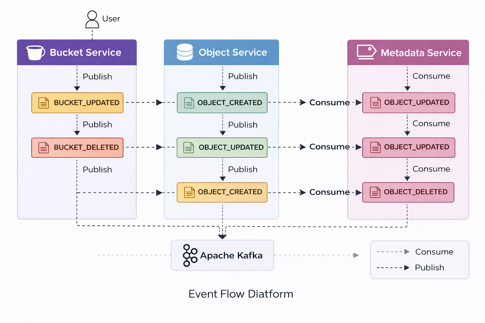

# Event Flow & Messaging Design

This document describes the event-driven architecture used in the S3-like Object Storage System.  
Apache Kafka is used to propagate domain events across microservices to ensure loose coupling, scalability, and eventual consistency.

---

## Overview

The system follows an event-driven microservices architecture where:
- Services do not directly modify each other's databases
- All cross-service communication happens via domain events
- Each event represents a business action
- Consumers process events idempotently

Kafka acts as the central messaging backbone.

---

## Why Event-Driven Architecture

Event-driven communication was chosen to:
- Avoid tight coupling between services
- Eliminate distributed transactions
- Enable independent service scaling and deployment
- Improve fault tolerance
- Mirror real-world cloud storage systems like Amazon S3

---

## Generic Event Design

All events follow a generic envelope + payload pattern.

### Generic Event Envelope

```json
{
  "eventId": "uuid",
  "eventType": "ENUM_VALUE",
  "sourceService": "SERVICE_NAME",
  "ownerId": "user-id",
  "occurredAt": "timestamp",
  "payload": {
    "payloadType": "PAYLOAD_ENUM",
    "...": "event-specific fields"
  }
}
```

### Design Characteristics

- A single generic event wrapper (S3Event<T>) is used across all services
- Enums are used for eventType, payloadType, and sourceService
- Payload polymorphism is handled using payloadType
- Jackson polymorphism is not applied on the event envelope
- Events are self-descriptive and backward-compatible

---

## Bucket Events (System Entry Point)

Buckets act as the root entity in the system.
Changes at the bucket level can affect all underlying objects.

### BUCKET_UPDATED Event

**Producer:** bucket-service  
**Consumers:** object-service

**Purpose:**
- Propagate bucket-level versioning configuration
- Synchronize versioning behavior across objects

**Flow:**
1. User updates bucket configuration
2. bucket-service persists the change
3. BUCKET_UPDATED event is published
4. object-service consumes the event
5. Objects inherit the updated versioning configuration

```json
{
  "eventId": "85fae763-27b7-462c-a1ad-496534e429ba",
  "eventType": "BUCKET_UPDATED",
  "sourceService": "BUCKET_SERVICE",
  "ownerId": "b2cf8d1a-3c33-4f12-956e-576a8a17d871",
  "occurredAt": 1767694492.643695,
  "payload": {
    "payloadType": "BUCKET_UPDATED",
    "bucketName": "my-photos",
    "versioningEnabled": false
  }
}
```

### BUCKET_DELETED Event

**Producer:** bucket-service  
**Consumers:** object-service

**Purpose:**
- Trigger cleanup of all objects belonging to the bucket
- Maintain downstream consistency

```json
{
  "eventId": "67eaa1c2-bb07-4ce3-97c1-a30d2c27691e",
  "eventType": "BUCKET_DELETED",
  "sourceService": "BUCKET_SERVICE",
  "ownerId": "b2cf8d1a-3c33-4f12-956e-576a8a17d871",
  "occurredAt": 1767699395.979333,
  "payload": {
    "payloadType": "BUCKET_DELETED",
    "bucketName": "my-photos"
  }
}
```

---

## Object Lifecycle Events

Object events represent the lifecycle of stored data.

### OBJECT_CREATED Event

**Producer:** object-service  
**Consumer:** metadata-service

**Purpose:**
- Create object metadata
- Persist tags
- Initialize versioning state

**Flow:**
1. User uploads a file
2. File is stored on the filesystem
3. Object record is saved
4. OBJECT_CREATED event is published
5. metadata-service creates metadata, tags, and initial version

```json
{
  "eventId": "d3d5f127-a8fc-4422-8496-5e04f6b2da65",
  "eventType": "OBJECT_CREATED",
  "sourceService": "OBJECT_SERVICE",
  "ownerId": "b2cf8d1a-3c33-4f12-956e-576a8a17d871",
  "occurredAt": 1767688774.661985,
  "payload": {
    "payloadType": "OBJECT_CREATED",
    "objectId": "0af73ea9-7735-4f6b-8da6-7378bfea504a",
    "bucketName": "my-photos",
    "fileName": "image.png",
    "description": "Sample photo",
    "tags": ["images", "travel"],
    "accessLevel": "PRIVATE",
    "versionEnabled": false
  }
}
```

### OBJECT_UPDATED Event

**Purpose:**
- Update metadata
- Create a new version if versioning is enabled

```json
{
  "eventId": "329ea505-655d-4f57-9f53-da6b9c8245f0",
  "eventType": "OBJECT_UPDATED",
  "sourceService": "OBJECT_SERVICE",
  "ownerId": "b2cf8d1a-3c33-4f12-956e-576a8a17d871",
  "occurredAt": 1767702953.583797,
  "payload": {
    "payloadType": "OBJECT_UPDATED",
    "objectId": "0af73ea9-7735-4f6b-8da6-7378bfea504a",
    "bucketName": "my-photos",
    "fileName": "image.png",
    "versionEnabled": true
  }
}
```

### OBJECT_DELETED Event

**Purpose:**
- Remove metadata
- Delete versions
- Maintain system consistency

---

## Idempotency Handling

To guarantee reliable processing:
- Each event has a unique eventId
- Consumers persist processed IDs in the processed_events table
- Duplicate events are ignored

This ensures exactly-once business semantics and safe retries.

---

## Event Flow Diagram

The following diagram illustrates the complete event flow across all services:



**Event Flow Overview:**

The following conceptual flow applies:
- **User** initiates requests to Bucket Service or Object Service
- **Bucket Service** publishes `BUCKET_UPDATED` and `BUCKET_DELETED` events
- **Object Service** consumes bucket events and publishes `OBJECT_CREATED`, `OBJECT_UPDATED`, and `OBJECT_DELETED` events
- **Metadata Service** consumes object events to maintain metadata, tags, and versions
- **Apache Kafka** acts as the central event bus connecting all services
- No circular dependencies exist - events flow in one direction

---

## Summary

The event-driven architecture provides:
- Loose coupling between services
- Clear ownership boundaries
- Scalable communication
- Production-grade reliability

This design closely mirrors real-world distributed object storage systems.